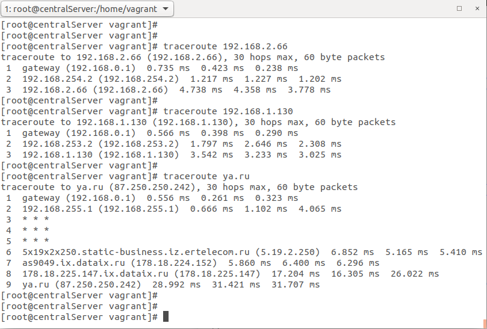
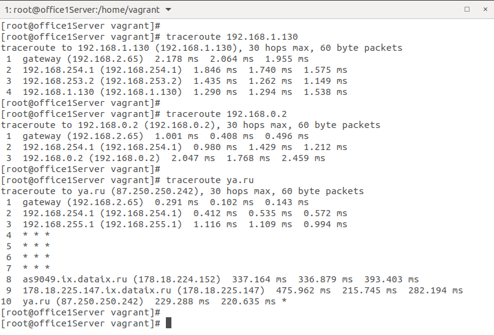
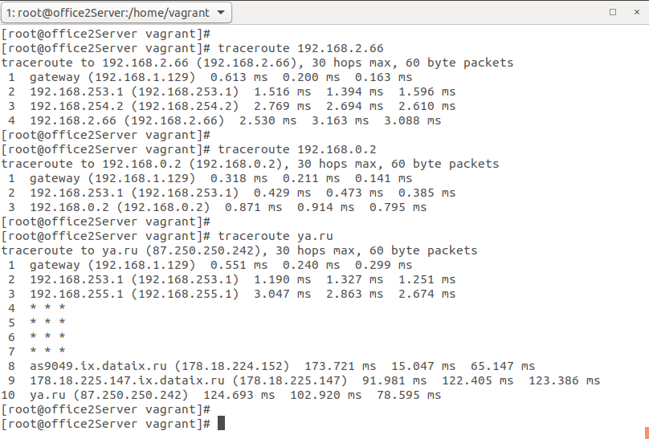

# Задание 16 "Разворачиваем сетевую лабораторию"

# otus-linux
Vagrantfile - для стенда урока 9 - Network

# Дано
https://github.com/erlong15/otus-linux/tree/network
(ветка network)

Vagrantfile с начальным построением сети
- inetRouter
- centralRouter
- centralServer

тестировалось на virtualbox

# Планируемая архитектура
построить следующую архитектуру

Сеть office1

- 192.168.2.0/26 - dev
- 192.168.2.64/26 - test servers
- 192.168.2.128/26 - managers
- 192.168.2.192/26 - office hardware

Сеть office2

- 192.168.1.0/25 - dev
- 192.168.1.128/26 - test servers
- 192.168.1.192/26 - office hardware


Сеть central

- 192.168.0.0/28 - directors
- 192.168.0.32/28 - office hardware
- 192.168.0.64/26 - wifi

```
Office1 ---\
	    -----> Central --IRouter --> internet
Office2----/
```
Итого должны получится следующие сервера

- inetRouter
- centralRouter
- office1Router
- office2Router
- centralServer
- office1Server
- office2Server

# Теоретическая часть
- Найти свободные подсети
- Посчитать сколько узлов в каждой подсети, включая свободные
- Указать broadcast адрес для каждой подсети
- проверить нет ли ошибок при разбиении

# Практическая часть
- Соединить офисы в сеть согласно схеме и настроить роутинг
- Все сервера и роутеры должны ходить в инет черз inetRouter
- Все сервера должны видеть друг друга
- у всех новых серверов отключить дефолт на нат (eth0), который вагрант поднимает для связи
- при нехватке сетевых интервейсов добавить по несколько адресов на интерфейс

____
# Решение

# Теоретическая часть

Сеть office1

- 192.168.2.0/26 - кол-во узлов 62, broadcast адрес 192.168.2.63
- 192.168.2.64/26 - кол-во узлов 62, broadcast адрес 192.168.2.127
- 192.168.2.128/26 - кол-во узлов 62, broadcast адрес 192.168.2.191
- 192.168.2.192/26 - кол-во узлов 62, broadcast адрес 192.168.2.255

Свободных подсетей нет.

Сеть office2

- 192.168.1.0/25 - кол-во узлов 126, broadcast адрес 192.168.1.127
- 192.168.1.128/26 - кол-во узлов 62, broadcast адрес 192.168.1.191
- 192.168.1.192/26 - кол-во узлов 62, broadcast адрес 192.168.1.255

Свободных подсетей нет.

Сеть central

- 192.168.0.0/28 - кол-во узлов 14, broadcast адрес 192.168.0.15
- 192.168.0.32/28 - кол-во узлов 14, broadcast адрес 192.168.0.47
- 192.168.0.64/25 - кол-во узлов 126, broadcast адрес 192.168.0.191

Свободные подсети в сети central:

- 192.168.0.16/28 - кол-во узлов 14, broadcast адрес 192.168.0.31
- 192.168.0.48/28 - кол-во узлов 14, broadcast адрес 192.168.0.63
- 192.168.0.192/26 - кол-во узлов 62, broadcast адрес 192.168.0.255

# Практическая часть

Для решения практической части задания был создан vagrant стэнд со всеми необходимыми роутерами и серверами и настроен роутинг.
Ниже приведены скриншоты команды traceroute c трех серверов.

1. Traceroute c centralServer до office1Server, office2Server, ya.ru.


2. Traceroute c office1Server до office2Server, centralServer, ya.ru.


3. Traceroute c office2Server до office1Server, centralServer, ya.ru.


