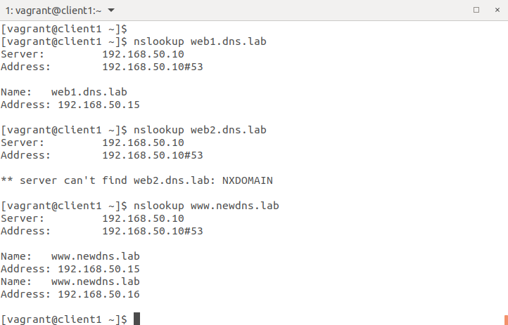
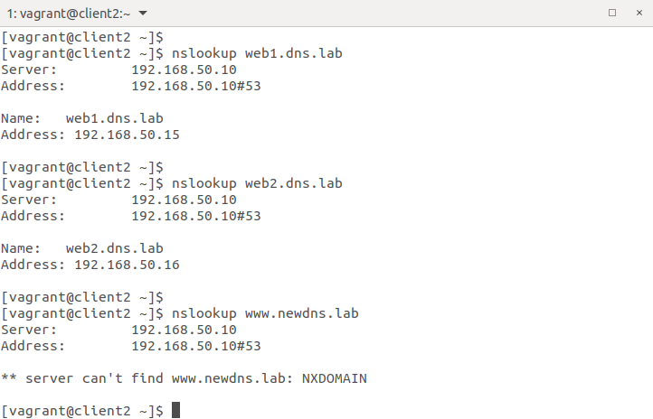

# Задание 22 "Настраиваем split-dns"

взять стенд https://github.com/erlong15/vagrant-bind
добавить еще один сервер client2
завести в зоне dns.lab 
имена
web1 - смотрит на клиент1
web2 смотрит на клиент2

завести еще одну зону newdns.lab
завести в ней запись
www - смотрит на обоих клиентов

настроить split-dns
клиент1 - видит обе зоны, но в зоне dns.lab только web1

клиент2 видит только dns.lab

*) настроить все без выключения selinux
Критерии оценки: 4 - основное задание сделано, но есть вопросы
5 - сделано основное задание
6 - выполнено задания со звездочкой
____
# Решение

Для решения задачи был подготовлен Vagrant стенд.
Ниже представлены скриншоты проверки с помощью команды ```nslookup```.

1. Клиент1 - видит обе зоны, но в зоне dns.lab только web1


2. Клиент2 видит только dns.lab


